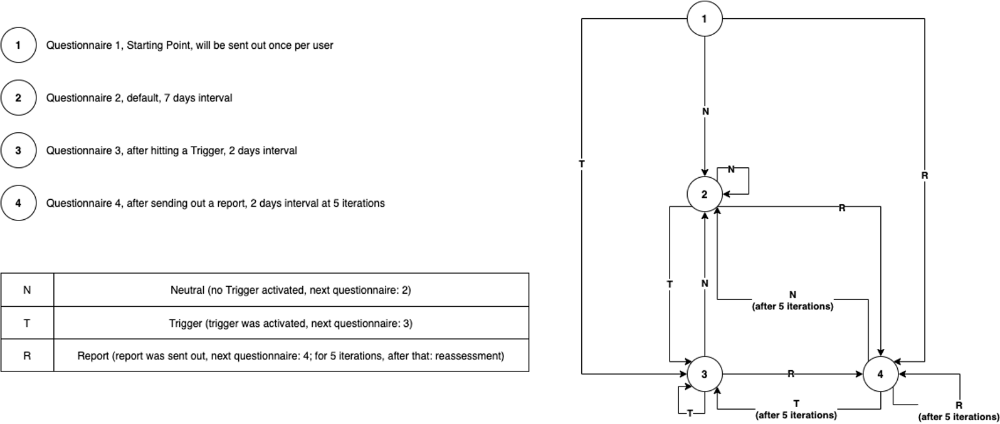

:important-caption: :heavy_exclamation_mark:

link:../README.adoc[← Table of Contents]

== Questionnaire distribution logic

=== Current Model

The current model that is used by the application is defined in link:../../../src/models/ExampleStateModel.ts[ExampleStateModel.ts].
It was defined by the GCS project and uses four different questionnaires that are send to the study participant based on specific rules.

The following image shows the different questionnaires and under what condition each one is send to the participants.
--
.Questionnaire State Chart

--

=== Implement your own model

If the requirements regarding the questionnaire state model are not met by the given model defined in link:../../../src/models/ExampleStateModel.ts[ExampleStateModel.ts],
you can provide your own model.

All you have to do is implement the given interface in link:../../../src/models/StateModel.ts[StateModel.ts]  and set the values depending on your requirements.
