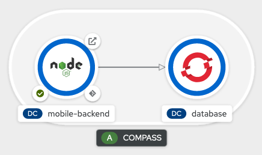
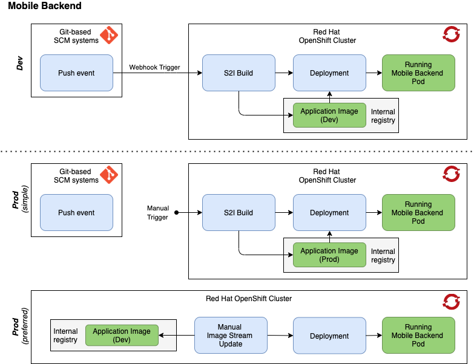

:important-caption: :heavy_exclamation_mark:

link:../docs[← Table of Contents]

== Deployment of backend components on Red Hat OpenShift

=== Background

==== What is Red Hat OpenShift?

The Red Hat OpenShift Container Platform is a collection of services and components that extend the Kubernetes container infrastructure. OpenShift simplifies the management of containerized application and provides monitoring and auditing capabilities with a high focus on security. The operating system used by OpenShift is Red Hat Enterprise Linux CoreOS

Refer to the section on <<furtherInformation>> for more details on Red Hat and OpenShift.

==== Why OpenShift?

OpenShift is the preferred plattform for the provisioning of the COMPASS backend components based  on the following  advantages:

1. Openshift guarantees *no vendor lock-in*
2. OpenShift is *open source*
3. OpenShift provides integrated developer workflows such as https://github.com/openshift/source-to-image[S2I]
4. Logging and metric services can be used out of the box
5. The web console provides unified access to the OpenShift capabilities

You can freely choose how to use OpenShift.
Either run a cluster on your local machine with https://developers.redhat.com/products/codeready-containers/overview[CodeReady Containers], use https://www.okd.io/#v3[OKD] - The (free) Community Distribution of Kubernetes that powers Red Hat OpenShift - or set up an OpenShift cluster with your preferred Cloud provider such as https://www.ibm.com/cloud/openshift[Red Hat OpenShift on IBM Cloud], https://aws.amazon.com/de/quickstart/architecture/openshift/[Red Hat OpenShift in AWS], or https://azure.microsoft.com/de-de/services/openshift/[Azure Red Hat OpenShift].

==== OpenShift Templates

This project provides templates to automate the setup of all necessary OpenShift resources. A template defines objects which will be created on the OpenShift Container Platform when it is processed. Information on templates is available https://docs.openshift.com/container-platform/4.6/openshift_images/using-templates.html[here].

=== Prerequisites

Before you can set up the COMPASS backend components you need a running OpenShift Cluster.
Define in which project you want to deploy the backend components. It is recommended, to use separate OpenShift projects for development and production.

* Login to your OpenShift Cluster using the CLI (https://docs.openshift.com/enterprise/3.2/cli_reference/get_started_cli.html[details])
* Check existing SSH key connection (https://docs.github.com/en/github/authenticating-to-github/adding-a-new-ssh-key-to-your-github-account[details])

[#developmentDeployment]
=== Development Deployment

The backend components - mobile backend and PostgreSQL database - can easily be set up via templates.
Different template files are provided for the development and production environment. Refer to the following sections for more information:

* <<mbSetup>>
* <<dbSetup>>
* <<productionDeployment>>
* <<troubleshooting>>

[#mbSetup]
==== Mobile Backend Setup

The template file compass-backend-template.yaml is designed to create all resources necessary for the deployment of the mobile backend including an instance of a persistent PostgreSQL database. It generates the following resources:

Resources for PostgreSQL database:

* 1 Service
* 1 Deployment Config
* 2 Secrets including database parameters and access data
* 1 Persistent Volume Claim

Resources for Mobile Backend:

* 1 Service
* 1 Image Stream
* 1 Route
* 1 Build Config
* 1 Deployment Config
* 4 Secrets for the webhooks and the git deploy key
* 1 Config map

The following step can be skipped, if you use a public repository.

Before you can process the template, you must set up a read-only SSH key pair to configure access for OpenShift to your Git-based SCM tool. Please note: This should not be your personal SSH key pair, but a dedicated deploy key which is used to permit read-access to the mobile back end repository.

In your .ssh directory generate a key pair with:

[source,shell]
----
$ ssh-keygen -o -a 100 -t ed25519 -f FileName -C "Comment" -N ''
----

Please do not set a passphrase for this SSH key, as this will prevent OpenShift from building successfully. (https://docs.openshift.com/online/pro/dev_guide/builds/build_inputs.html[details])

Insert the newly created public key in the deploy keys section of your Git-repository. Check out the documentation on how this is done for https://docs.github.com/en/free-pro-team@latest/developers/overview/managing-deploy-keys[GitHub] and https://docs.gitlab.com/ee/user/project/deploy_keys/[GitLab].

You can now apply the compass-backend-template and create the resources stated above via the command below. When using a Windows machine preferably run the command in the Git Bash or Commander in order to prevent problems with the Linux commands cat and base64.

[source,shell]
----
$ oc new-app --file your/path/to/compass-backend-template.yaml \
> -n your_openshift_project_name \
> -p APP_GIT_URL="repository_link" \
> -p "PUBLIC_KEY=$(echo "$(cat your/path/to/public_key)" | base64 )" \
> -p "PRIVATE_KEY=$(echo "$(cat your/path/to/private_key)" | base64 )" \
> -p "CERTIFICATE=$(echo "$(cat your/path/to/certificate)" | base64 )" \
> -p "SSH_PRIVATE_KEY=$(echo "$(cat your/path/to/private_deploy_key)" | base64 )" \
> [-p param=value] #optional
----

[horizontal]
APP_GIT_URL:: "Clone with SSH" link to the Git-repository if repository is private and a deploy key is set. Otherwise use HTTPS link.
PRIVATE_KEY:: Private SSH key of mobile backend corresponding to PUBLIC_KEY, needed for signature creation of encrypted documents in backend
PUBLIC_KEY:: Public SSH key of mobile backend corresponding to PRIVATE_KEY, primarily used for testing purposes for signature verification.
CERTIFICATE:: The Certificate used for the encryption of the questionnaire responses by the NUM app. This is optional, so you can just leave this parameter out, if for example you set it in the frontend, i.e. the app
SSH_PRIVATE_KEY:: Dedicated private deploy key added to your Git-repository for authentication to deploy a private repository to OpenShift. In case the repository is public, you can omit this parameter.

You obtain more information on the template  parameters via the following command:
[source,shell]
----
$ oc process --parameters -f your/path/to/compass-backend-template.yaml
----

If you want to observe the build, use `oc logs -f bc/mobile-backend``

To see the resulting OpenShift resources, use `oc status` and make sure you take a look at the Topology View in the OpenShift web console:

The build config for the mobile backend is configured with a webhook. Add this to your Git repository in order to automatically deploy a new version of the app when a new commit is made. Consult the documentation of https://docs.github.com/en/free-pro-team@latest/developers/webhooks-and-events/about-webhooks[GitHub] and https://docs.gitlab.com/ee/user/project/integrations/webhooks.html[GitLab] on how  this is done.

[#dbSetup]
==== Database Setup

After you have created the database and mobile backend resources you can setup the database.
Follow the documentation in the db/migration directory.

[#productionDeployment]
=== Production Deployment

It is recommended to perform the setup for production in a separate project.

==== Mobile Backend Setup

Two deployment types are suggested for the mobile backend. Both are visualized in the picture below.

IMPORTANT: For both types it is strongly recommended to setup limit ranges for the resource consumption. Refer to the end of the <<mbSetup>> on how to do this.

===== Preferred Method

The preferred method for deploying the mobile backend in the production environment is to manually update the corresponding image stream. Thereby, you can use a pre-existing image which has been fully tested before.

Use the template named compass-backend-template-*prod*.yaml to set up the required resources.
[source,shell]
----
$ oc new-app --file your/path/to/compass-backend-template-prod.yaml \
> -n your_openshift_project_name
> -p "PUBLIC_KEY=$(echo "$(cat your/path/to/public_key)" | base64 )" \
> -p "PRIVATE_KEY=$(echo "$(cat your/path/to/private_key)" | base64 )" \
> -p "CERTIFICATE=$(echo "$(cat your/path/to/certificate)" | base64 )"
> [-p param=value] #optional
----

You can obtain more information on the template parameters via the following command:
[source,shell]
----
$ oc process --parameters -f your/path/to/compass-backend-template-prod.yaml
----

The template creates the following resources:

Resources for PostgreSQL database:

* 1 Service
* 1 Deployment Config
* 2 Secrets including database parameters and access data
* 1 Persistent Volume Claim

Resources for Mobile Backend:

* 1 Service
* 1 Image Stream
* 1 Route
* 1 Deployment Config
* 1 Config map

Update the created image stream to point to the latest image that was build in the development environment.
[source,shell]
----
$ oc tag your_dev_project/name_of_dev_is:dev \
> your_prod_project/name_of_prod_is:prod
----

This  will *not* result in an automatic update of the tag, if you issue a new build in the development environment.

Use this command whenever you want to start a new production deployment from a new image.
If you wish to target another image than the latest, reference it specifically in the `oc tag` command.

===== Simple Method

Alternatively, you can use the same procedure as described in the *Development Deployment* section, with the only difference that new builds are triggered manually. Thereby you can decide which code base to deploy to production.

Apply the compass-backend-template and specify the necessary parameters.

IMPORTANT: The template will generate webhooks, which you can use. However, it is *not* recommended to set up automatic build hooks for production environments.

You can either trigger a new build via the OpenShift web console or via the CLI. Both options will automatically result in a new deployment after the build is successfully completed.

Use the *Developer* view of the web console to navigate to the build configuration of the mobile backend in the *Builds* section. Start a new build by selecting the corresponding option from the *Actions* drop-down.

Use the following command if you prefer to start a new build via the CLI:

[source,shell]
----
$ oc start-build bc/name_of_your_bc -n <your_project_name>
----

==== Database Setup

Refer to <<dbSetup>>.

==== Push Service Credentials (FCM)

Step 1. Create service account credentials for Firebase Cloud Messaging by following the steps outlined here: https://firebase.google.com/docs/cloud-messaging/auth-server#provide-credentials-manually and download the service account ".json"

Step 2. We will create a secret with the file as content.
First we need to encode the file content:
[source,shell]
----
$ base64 -i ~/path/to/downloads/credentials.json
----

Step 3. Import the secret into your OpenShift project.
Copy "ocp_deployment/templates/google-services-secret.yaml.sample" and rename to "ocp_deployment/templates/google-services-secret.yaml"
Replace the string "BASE64_CREDENTIAL_STRING" in this file with the encoded content generated in the previous step.

Step 4. Deploy the secret to the cluster:
[source,shell]
----
$ oc create -f google-services-secret.yaml
----

Step5. Update Deployment Config to use the secret as file.
For example:
[source,yaml]
----
kind: DeploymentConfig
apiVersion: apps.openshift.io/v1
metadata:
  name: mobile-backend
spec:

  template:
    spec:
      containers:
        - resources: {}
        ...
          env:
            - name: GOOGLE_APPLICATION_CREDENTIALS
              value: /opt/app-root/secrets/google-services.json
          volumeMounts:
            - name: secrets
              mountPath: /opt/app-root/secrets
              readOnly: true
      volumes:
        - name: secrets
          secret:
            secretName: google-services-secret
----

[#troubleshooting]
=== Troubleshooting

[horizontal]
"No such file or directory":: Make sure, the paths to all files and directories are specified correctly (absolute and relative path notation).

"Permission denied (publickey,keyboard-interactive)":: Verify your repository access rights. Permission will also be denied, if your deploy key (SSH_PRIVATE_KEY) was created with a passphrase.

"dquote>":: A double quote character (") is not properly closed. Only use pairs of quote characters and check for wrong character formats (“) which can occur during copy-paste processes.

Wiping Project Resources:: To re-run "oc new-app", make sure all resources are deleted properly. Delete all resources using the OpenShift UI in Administrator view, or use "oc delete all --all" and "oc delete secrets --all" and verify every resource is deleted in the UI. You may have to manually remove Persistent Volume Claims (PVC) and Config Maps.

[#furtherInformation]
=== Further Information

* OKD 4 (free community distribution of kubernetes, that powers OpenShift): https://www.okd.io/
* Red Hat OpenShift Documentation: https://docs.openshift.com/
* PostgreSQL: https://www.postgresql.org/
* PostgreSQL template: https://docs.okd.io/latest/using_images/db_images/postgresql.html
